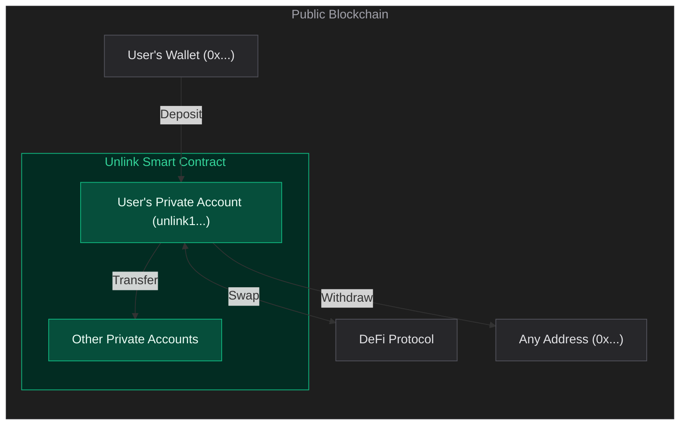

> ## Documentation Index
> Fetch the complete documentation index at: https://docs.unlink.xyz/llms.txt
> Use this file to discover all available pages before exploring further.

# Introduction

> Add private wallets and transactions to your app.

Unlink lets you add private blockchain wallets to your app. Your users can:

* Own accounts (single or multi-signature)
* Send tokens (privately and publicly)
* Receive tokens (privately)
* Interact with smart contracts (DeFi, and more...)

All without exposing balances or transaction history — while keeping the full guarantees of the underlying blockchain.

## The Problem

Public blockchains are transparent by design. Every transfer, every balance, every interaction is permanently visible to anyone. For companies building on-chain products, this is a dealbreaker:

* No payment app gains adoption if every transaction is traceable
* No payroll system works if every salary is public
* No treasury operates when competitors can see every move

Financial privacy is not about hiding. It's about giving your users control over who sees what.

## What you can build

* **Neobank** — On-chain banking where users' financial activity stays private
* **Payroll** — Salaries and contractor payments that stay confidential
* **DeFi** — Trading, borrowing, and lending without exposing positions or strategy
* **Treasury** — Organizational fund management without revealing strategic decisions
* **Stablecoin payments** — Move dollars on-chain while keeping balances private
* **OTC trading** — Settle peer-to-peer trades privately
* **Donations & grants** — Let users support causes without linking their identity
* **AI agents** — Autonomous agents that execute confidential transactions

## How Unlink works

Unlink is a smart contract deployed on the blockchain itself — no bridging, no separate chain.

<CardGroup cols={2}>
  <Card title="1. Create an account" icon="key">
    Use the [SDK](/getting-started) to create an Unlink account for your user.
    This generates their private keys from a single mnemonic. Each account has a
    unique Unlink address (`unlink1...`).
  </Card>

  <Card title="2. Fund the wallet" icon="arrow-down-to-bracket">
    Your user deposits tokens from their public wallet. Once inside the private
    account, tokens are only visible to them. Unlink is now their wallet.
  </Card>
</CardGroup>

From here, everything is private. Single-signature or multi-signature — balances and activity are never exposed.

<CardGroup cols={3}>
  <Card title="Transfer" icon="paper-plane">
    Send tokens privately to another Unlink account. Sender, recipient, and
    amount are all hidden by a zero-knowledge proof.
  </Card>

  <Card title="Withdraw" icon="arrow-up-from-bracket">
    Move tokens back to any public address. The withdrawal amount and recipient
    are visible on-chain.
  </Card>

  <Card title="DeFi" icon="arrows-rotate">
    Swap, lend, borrow directly from the private account — without exposing
    positions or strategy.
  </Card>
</CardGroup>

<Info>
  **What's private, what's public**

  |                | Deposit                              | Transfer                             | Withdraw                             |
  | -------------- | ------------------------------------ | ------------------------------------ | ------------------------------------ |
  | **Amount**     | Public                               | <Badge color="green">Private</Badge> | Public                               |
  | **Sender**     | Public                               | <Badge color="green">Private</Badge> | <Badge color="green">Private</Badge> |
  | **Recipient**  | <Badge color="green">Private</Badge> | <Badge color="green">Private</Badge> | Public                               |
  | **Token type** | Public                               | <Badge color="green">Private</Badge> | Public                               |
</Info>
